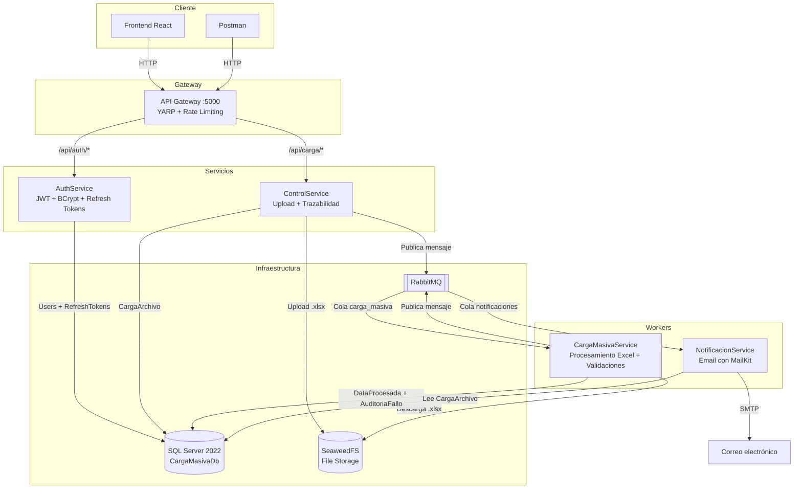
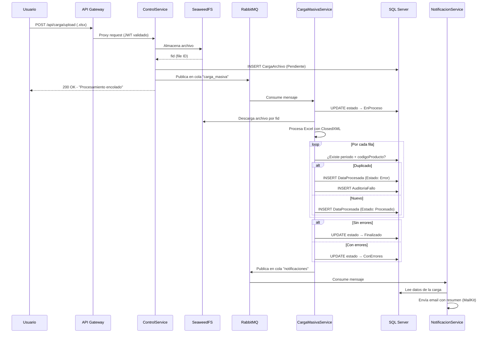
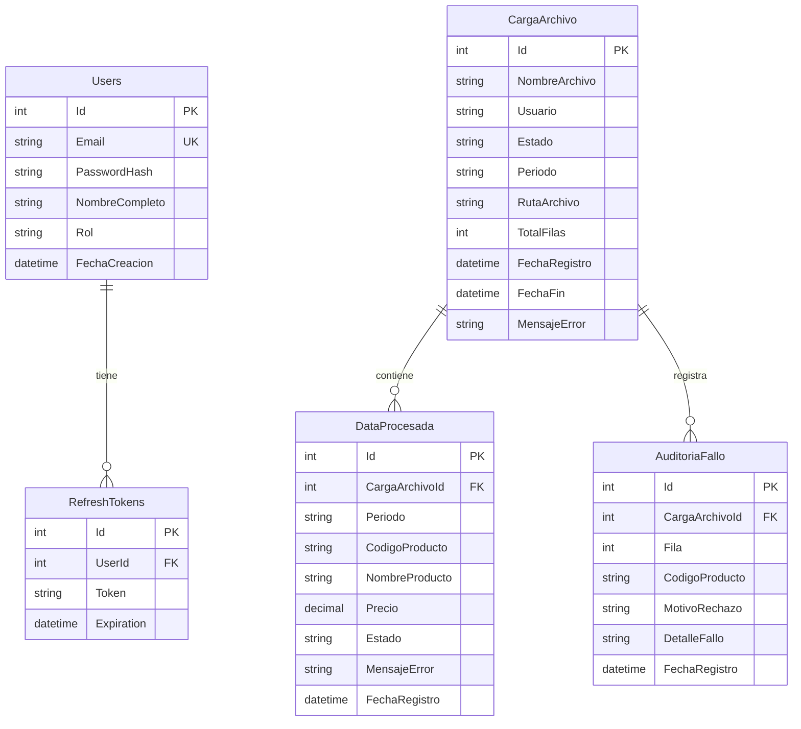

# Sistema de Carga Masiva — Microservicios .NET 9

Sistema de microservicios para carga masiva de archivos Excel con procesamiento asíncrono, persistencia en SQL Server y notificaciones por correo electrónico.

## Arquitectura



### Flujo de procesamiento



### Modelo de datos



## Stack Tecnológico

| Componente | Tecnología |
|---|---|
| Framework | .NET 9 |
| ORM | Entity Framework Core 9 |
| Base de Datos | SQL Server 2022 |
| Cola de Mensajes | RabbitMQ 3 |
| Almacenamiento | SeaweedFS |
| Gateway | YARP Reverse Proxy |
| Autenticación | JWT Bearer + Refresh Tokens |
| Hashing | BCrypt |
| Excel | ClosedXML |
| Email | MailKit |
| Logging | Serilog |
| Frontend | React 18 + Material UI |
| Contenedores | Docker + Docker Compose |

## Microservicios

### API Gateway (puerto 5000)
- Reverse proxy con YARP
- Validación JWT centralizada
- Rate Limiting (Fixed Window: 100 req/60s por IP)
- CORS habilitado
- Rutas: `/api/auth/*` → AuthService, `/api/carga/*` → ControlService

### AuthService
- Login con email/password
- Generación de JWT (2h expiración) con claims: userId, email, role
- Refresh Tokens (7 días expiración)
- Password hashing con BCrypt
- Usuario seed: `admin@cargamasiva.com` / `Admin123!`

### ControlService
- Upload de archivos Excel (.xlsx, máximo 10MB configurable)
- Almacenamiento en SeaweedFS
- Publicación a cola RabbitMQ `carga_masiva`
- Historial de cargas por usuario
- Detalle de carga con datos procesados (estado por fila)
- Endpoint de reemplazo para registros duplicados
- Requiere autenticación JWT

### CargaMasivaService (Worker)
- Consume cola `carga_masiva`
- Descarga archivo de SeaweedFS
- Procesa Excel con ClosedXML
- Validación a nivel de fila por periodo + código de producto
- Registros duplicados se insertan con estado `Error` (no se descartan)
- Estados de carga: `Pendiente` → `EnProceso` → `Finalizado` | `ConErrores`
- Publica a cola `notificaciones`
- Espera pre-migración: verifica existencia de tabla `CargaArchivo` antes de migrar (evita race condition entre microservicios)

### NotificacionService (Worker)
- Consume cola `notificaciones`
- Envía email HTML con resumen de la carga vía MailKit
- Preserva estado `ConErrores` (no lo sobreescribe con `Notificado`)

### Frontend (puerto 3000)
- React 18 con Material UI
- Login con persistencia de JWT en localStorage
- Upload de archivos Excel con drag & drop
- Historial de cargas con estado visual (chips de colores)
- Detalle de carga con estado por fila (Procesado/Error)
- Acción de reemplazo en filas con error

## Validación y manejo de duplicados

La validación se realiza a **nivel de fila** por la combinación `periodo + codigoProducto`:

1. Si la combinación ya existe en `DataProcesada`, la fila se inserta con `Estado = "Error"` y se registra en `AuditoriaFallo`
2. Si no existe, se inserta con `Estado = "Procesado"`
3. Si hay al menos una fila con error, la carga queda en estado `ConErrores`
4. Desde el detalle, el usuario puede hacer clic en **Reemplazar** en cada fila con error:
   - Elimina el registro existente (el que causó el conflicto)
   - Marca la fila como `Procesado`
   - Si no quedan más errores, la carga pasa automáticamente a `Finalizado`

## Formato del Excel

| Columna | Tipo | Requerido |
|---|---|---|
| Periodo | texto (ej: 2025-03) | Sí |
| CodigoProducto | texto (ej: P0001) | Sí |
| NombreProducto | texto | Sí |
| Precio | decimal | Sí |

## Stored Procedures

| SP | Descripción |
|---|---|
| `sp_ActualizarEstadoCarga` | Actualiza estado, mensaje de error y fecha fin |
| `sp_ValidarPeriodo` | Verifica cargas existentes activas o finalizadas por periodo |
| `sp_InsertarDataProcesada` | Inserta dato validando duplicado por periodo + código de producto |
| `sp_ObtenerHistorialCargas` | Lista cargas con paginación |
| `sp_InsertarAuditoriaFallo` | Registra fallo de auditoría |

## Despliegue

### Prerrequisitos
- Docker y Docker Compose

### Levantar todos los servicios

```bash
docker-compose up --build
```

Todos los servicios se configuran automáticamente:
- Migraciones de base de datos se ejecutan al iniciar
- Stored procedures se crean al iniciar CargaMasivaService
- Usuario administrador se seedea en AuthService
- Colas de RabbitMQ se declaran automáticamente

### Configurar SMTP (opcional)

Editar las variables de entorno en `docker-compose.yml`:

```yaml
- SMTP__Host=smtp.gmail.com
- SMTP__Port=587
- SMTP__User=tu_correo@gmail.com
- SMTP__Password=tu_app_password
- SMTP__From=tu_correo@gmail.com
```

> Si no se configura, el sistema funciona normalmente pero sin envío de correos.

### Servicios expuestos

| Servicio | URL |
|---|---|
| Frontend | http://localhost:3000 |
| API Gateway | http://localhost:5000 |
| RabbitMQ Management | http://localhost:15672 (guest/guest) |
| SQL Server | localhost:1433 (sa/SqlServer2024!) |
| SeaweedFS Master | http://localhost:9333 |

## Endpoints

### Autenticación
```
POST /api/auth/login                          — Login (retorna JWT + Refresh Token)
POST /api/auth/refresh                        — Renovar token
```

### Carga de Archivos (requiere JWT)
```
POST /api/carga/upload                        — Subir archivo Excel (multipart/form-data)
GET  /api/carga/historial                     — Historial de cargas del usuario
GET  /api/carga/{id}                          — Info de una carga
GET  /api/carga/{id}/detalle                  — Detalle con datos procesados por fila
POST /api/carga/detalle/{detalleId}/reemplazar — Reemplazar registro duplicado
```

## Patrones de diseño

| Patrón | Uso |
|---|---|
| **Repository** | `IRepository<T>` / `Repository<T>` — abstracción genérica de acceso a datos con EF Core, replicado en cada microservicio |
| **Dependency Injection** | Todos los servicios, repositorios e interfaces se registran en el contenedor de DI de .NET (`Program.cs`) |
| **Publish/Subscribe** | Comunicación asíncrona entre servicios mediante colas de RabbitMQ (`carga_masiva`, `notificaciones`) |
| **API Gateway** | Punto único de entrada con YARP como reverse proxy, centraliza autenticación y rate limiting |
| **BackgroundService (Worker)** | `CargaMasivaWorker` y `NotificacionWorker` heredan de `BackgroundService` para procesamiento en segundo plano |
| **Middleware Pipeline** | `ExceptionMiddleware` para manejo global de errores con respuestas estandarizadas (`ProblemDetails`) |
| **DTO (Data Transfer Object)** | Separación entre entidades de dominio y objetos de respuesta (`CargaHistorialDto`, `DataProcesadaDto`, `UploadResponse`) |
| **Options Pattern** | Configuración tipada vía `IConfiguration` para JWT, SMTP, RabbitMQ, SeaweedFS y Rate Limiting |

### Capas por microservicio

```
Controller → Interface → Service → Repository → DbContext
```

- Cada capa depende de abstracciones (interfaces), no de implementaciones concretas
- `ExcludeFromMigrations()` permite que cada servicio solo migre las tablas que le pertenecen en la base de datos compartida
- Migraciones automáticas con reintentos al iniciar cada servicio

## Convenciones de nomenclatura

| Elemento | Convención | Ejemplo |
|---|---|---|
| Clases y métodos | PascalCase | `CargaService`, `GetHistorialAsync` |
| Interfaces | PascalCase con prefijo `I` | `ICargaService`, `IRepository<T>` |
| Variables y parámetros | camelCase | `idCarga`, `fileStream`, `mensaje` |
| Campos privados | camelCase con prefijo `_` | `_cargaRepository`, `_logger`, `_dbContext` |
| Constantes y enums | PascalCase | `Pendiente`, `EnProceso`, `Finalizado` |
| Métodos async | Sufijo `Async` | `ProcesarCargaAsync`, `SendEmailAsync` |
| Tablas SQL | PascalCase singular | `CargaArchivo`, `DataProcesada`, `AuditoriaFallo` |
| Stored Procedures | Prefijo `sp_` + PascalCase | `sp_InsertarDataProcesada`, `sp_ValidarPeriodo` |
| Colas RabbitMQ | snake_case | `carga_masiva`, `notificaciones` |
| Endpoints REST | kebab-case, sustantivos plurales | `/api/carga/historial`, `/api/auth/login` |
| Archivos .cs | PascalCase, uno por clase | `CargaService.cs`, `ExceptionMiddleware.cs` |
| Carpetas | PascalCase | `Controllers/`, `Services/`, `Repositories/`, `Models/` |
| Variables de entorno | PascalCase con `__` como separador | `ConnectionStrings__DefaultConnection`, `RabbitMQ__HostName` |
| Props React (JS) | camelCase | `detalle.nombreArchivo`, `estadoColor` |
| Componentes React | PascalCase | `Detalle.js`, `Historial.js`, `Upload.js` |

## Estructura del Proyecto

```
├── docker-compose.yml
├── src/
│   ├── ApiGateway/          — YARP + JWT + Rate Limiting
│   ├── AuthService/         — Autenticación JWT + BCrypt
│   ├── ControlService/      — Upload + SeaweedFS + RabbitMQ Publisher + Detalle
│   ├── CargaMasivaService/  — Worker: Procesamiento Excel + Validaciones por fila
│   ├── NotificacionService/ — Worker: Email con MailKit
│   └── frontend-app/       — React + Material UI
└── postman/
    └── PruebaTecnica.postman_collection.json
```

Cada microservicio tiene su propio `.sln` y `Dockerfile` para builds independientes.
